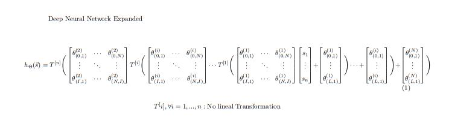

DeepXDE
=======

Theory Behind Inverse Problems

To do. Explain the theory for inverse problems, and add references.

https://www.overleaf.com/5389572137znnjcpqctqxj

Installation 
============

**Requirements**

To run **DeepXDE** on your local machine or a cluster, you need to install at least one backend (for example, **TensorFlow**).
Install **TensorFlow** using the command line: ::

$ pip install tensorflow  #Using pip as a installer
$ conda install tensorflow #Using conda as a installer

If you are using GPUs, you can install ``tensorflow-gpu`` rather than ``tensorflow``.
The next step is to **install the DeepXDE library** with one of these commands: ::

$ pip install deepxde #Using pip as installer
$ conda install deepxde #Using conda as installer

Once TensorFlow and DeepXDE were installed, you can check if the installation was successful running a IPython or Jupyter session and importing the library on it.

**How to run DeepXDE examples**

The first step is to clone the library repository in your computer cluster using git: ::

$ git clone https://github.com/lululxvi/deepxde.git

Second step, change Python PATH to the library directory: ::

$ export PYTHONPATH=$PYTHONPATH:/root/shared/deepxde

One time the repository was clone and the PATH was updated, you are ready to run some library examples that are located in the examples directory.

Solving a Time-independent PDE: 
===============================

For the original solution you can go to the 
`DeepXDE documentation <https://deepxde.readthedocs.io/en/latest/demos/pinn_forward/helmholtz.2d.dirichlet.html>`_.

Given a wavenumber: :math:`k_{0}=2\pi n` with :math:`n=2`.

You will solve a Helmholtz equation:

.. math:: - u_{xx} - u_{yy} - {k^2}_0u=f,\qquad \Omega={[0,1]}^2

Where :math:`f`:

.. math:: f(x,y)={k^2}_0\sin{(k_0x)}\sin{(k_0y)}

With the Dirichlet boundary conditions:

.. math:: u(x,y)=0,\qquad (x,y) \in \partial \Omega

And finally, the solution is:

.. math:: u(x,y)=\sin{(k_0x)}\sin{(k_0y)}

First, import DeepXDE, Numpy, and TensorFlow (for this example) modules::

    import deepxde as dde
    import numpy as np
    from deepxde.backend import tf

Now, define the general variables of the problem::

    n = 2
    precision_train = 10
    precision_test = 30
    hard_constraint = True
    weights = 100

Defining the epochs (number of steps), the learning rate, the number of layers and nodes, and the activation function::
    
    epochs = 10000
    parameters = [1e-3, 3, 150, "sin"]
        
    sin = tf.sin
    
    learning_rate, num_dense_layers, num_dense_nodes, activation_func = parameters

Now, we define the PDE residual of the principal equation::

    def pde(x,u):
        dy_xx = dde.grad.hessian(u,x,i=0,j=0)
        dy_yy = dde.grad.hessian(u,x,i=1,j=1)

        f = k0**2*sin(k0*x[:,0:1])*sin(k0*x[:,1:2])
        return -dy_xx-dy_yy-k0**2*u-f

**Note**: The first input is both variables, x and y, because they are the domain. The second argument is the solution :math:`u(x)`.

Now, we introduce the exact solution::

    def exact_func(x):
        return np.sin(k0*x[:,0:1])*np.sin(k0*x[:,1:2])
    
    def transformation(x,u):
        res = x[:,0:1]*(1-x[:,0:1])*x[:,1:2]*(1-x[:,1:2])
        return res*u

Now, we define the domain as a rectangle and evaluate the training and test random collocation points. 
This values allow us to obtain collocation points density of 10 (respect 30) points per wavelength along each direction::

    geom = dde.geometry.Rectangle([0,0],[1,1])
    k0 = 2*np.pi*n
    wave_len = 1 / n

    hx_train = wave_len / precision_train
    nx_train = int(1 / hx_train)

    hx_test = wave_len / precision_test
    nx_test = int(1 / hx_test)

    bc = []

Then, we group all of our data and generate the training and testing points::

    data = dde.data.PDE (
        geom,
        pde,
        bc,
        num_domain = nx_train**2,
        num_boundary = 4*nx_train,
        solution = exact_func,
        num_test = nx_test**2,
    )

Now, it's time to choose the network. In this example, we use a fully connected nerual network of depth 4 (3 hidden layers) and width of 150.
The activation function in this case is `sin` and `Glorot uniform` as initializer::

    network = dde.nn.NN(
        [2] + [numb_dense_nodes]*num_dense_layers + [1], activation, "Glorot uniform"
    )
    
    net.apply_output_transform(transform)

Now, we have the PDE and the network. With this we build a `Model` and define the optimizer and learning rate::

    model = dde.Model(data, net)

    loss_weights = [1, weights]
    model.compile(
        "adam",
        lr = learning_rate,
        metrics = ["l2 relative error"],
    )

We will train the model for :math:`10000` iterations with Adam optimizer::

    losshistory, train_state = model.train(epochs = epochs)

Saving the plots::

    dde.saveplot(losshistory, train_state, issave = True, isplot = True)

**Full Code**::

    import deepxde as dde
    import numpy as np
    from deepxde.backend import tf

    n = 2
    precision_train = 10
    precision_test = 30
    hard_constraint = True
    weights = 100
    
    epochs = 10000
    parameters = [1e-3, 3, 150, "sin"]
        
    sin = tf.sin
    
    learning_rate, num_dense_layers, num_dense_nodes, activation_func = parameters

    def pde(x,u):
        dy_xx = dde.grad.hessian(u,x,i=0,j=0)
        dy_yy = dde.grad.hessian(u,x,i=1,j=1)

        f = k0**2*sin(k0*x[:,0:1])*sin(k0*x[:,1:2])
        return -dy_xx-dy_yy-k0**2*u-f

    def exact_func(x):
        return np.sin(k0*x[:,0:1])*np.sin(k0*x[:,1:2])
    
    def transformation(x,u):
        res = x[:,0:1]*(1-x[:,0:1])*x[:,1:2]*(1-x[:,1:2])
        return res*u

    geom = dde.geometry.Rectangle([0,0],[1,1])
    k0 = 2*np.pi*n
    wave_len = 1 / n

    hx_train = wave_len / precision_train
    nx_train = int(1 / hx_train)

    hx_test = wave_len / precision_test
    nx_test = int(1 / hx_test)

    bc = []

    data = dde.data.PDE (
        geom,
        pde,
        bc,
        num_domain = nx_train**2,
        num_boundary = 4*nx_train,
        solution = exact_func,
        num_test = nx_test**2,
    )

    net = dde.nn.FNN(
       [2] + [num_dense_nodes] * num_dense_layers + [1], activation, "Glorot uniform"
    )

    net.apply_output_transform(transform)

    model = dde.Model(data, net)

    loss_weights = [1, weights]
    model.compile(
        "adam",
        lr = learning_rate,
        metrics = ["l2 relative error"],
    )

    losshistory, train_state = model.train(epochs = epochs)
    dde.saveplot(losshistory, train_state, issave = True, isplot = True)

Bibliography
------------

- DeepXDE: A Deep Learning Library for solving differential equations, Lu, Lu and Meng, Xuhui and Mao, Zhiping and Karniadakis, George Em, SIAM Review (2021) [`link <https://epubs.siam.org/doi/pdf/10.1137/19M1274067>`_]
- Physics-informed neural networks: A deep learning framework for solving forward and inverse problems involving nonlinear partial differential equations, M. Raissi and P. Perdikaris and G.E. Karniadakis, Journal of Computational Physics (2019) [`link <https://www.sciencedirect.com/science/article/pii/S0021999118307125>`_]
