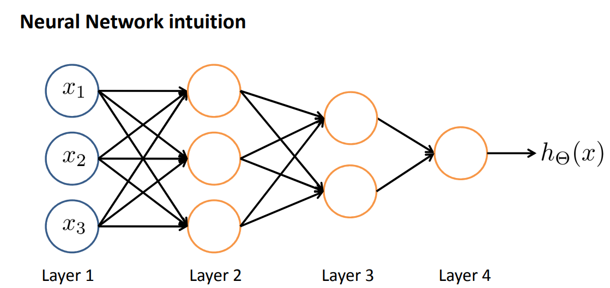
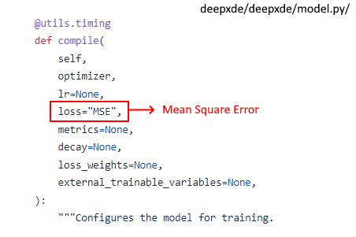

=====================
Neural Network Theory
=====================

.. todo:: 

    To do. Explain the theory for inverse problems, and add references.

Summary of typical industrial process engineering problems
----------------------------------------------------------

As a review of theory and physical concepts, you can find the class readings by Professor María Thomsen Solis from the Adolfo Ibáñez University and the python file made by Artemio Araya. Completion of this teaching material will continue to be developed after the project.

====

**Momentum Conservation**

`M.T Class Lectures <https://drive.google.com/file/d/1BlXg5ymmiAKZ5J5dcu6JQZWL5Yius6QL/view?usp=sharing>`__.

Python File: https://colab.research.google.com/drive/1PhjGNHVIGK0Jek4NyEskEKfb3Ihl9LZy?usp=sharing

====

**Cinematic**

`M.T Class Lectures <https://drive.google.com/file/d/1YhQSburG66JWN0IEQgdkFFf3OaXRe2GT/view?usp=sharing>`__.

Python File: https://colab.research.google.com/drive/1f8_eslVUXN0-8IDR3ASJoHXNIMRTH7oL?usp=sharing

====

**Static**

`M.T Class Lectures <https://drive.google.com/file/d/1QERWlV-Ztj2wzNyQ8vWU8euGz42OO7R6/view?usp=sharing>`__.

Python File: `<https://colab.research.google.com/drive/1E2HEK9027jVSRXRMAz5m2LPH0_wtlFtE?usp=sharing>`__

====

**Fluyid Dynamics**

`M.T Class Lectures <https://drive.google.com/file/d/1BxTonblF8azjkXSE-xcZeW8Qyyy8xRzP/view?usp=sharing>`__.

Python File: https://colab.research.google.com/drive/1C82mvWWrylb3vxYrxfU0TRjgb6NntUfd?usp=sharing

`M.T Class Lectures <https://drive.google.com/file/d/140Gbbw9qTX1EN4t7PYPgFnUYadKAPk85/view?usp=sharing>`__.

Python File: https://colab.research.google.com/drive/1ftpYxW6-W1iypHdhIPFn7MFofvb26gNm?usp=sharing

`M.T Class Lectures <https://drive.google.com/file/d/1lpRTIV1evP8OF2US6XV1EnTfpjCHtbeZ/view?usp=sharing>`__.

Python File: https://colab.research.google.com/drive/1bC4P4eJ6GHxDjwqHh73IT9ubplW9VA99?usp=sharing

====

**Heat Transfer**

`M.T Class Lectures <https://drive.google.com/file/d/1YGLTkY-rtHdX8B21JP-L_OlvebzcE9zY/view?usp=sharing>`__.

`M.T Class Lectures <https://drive.google.com/file/d/1W-3-1duyDI8AZVkgq9e_KdDxvRN4ptUU/view?usp=sharing>`__.

Python File: `<https://colab.research.google.com/drive/1q7A5HT_-1zoukSDZyjal9FPLG_imlm6J?usp=sharing>`__

Python File: `<https://colab.research.google.com/drive/1JUzUBPEuqnKYCxo6BxNY5sAM3XhbzxeH?usp=sharing>`__

Pyhton File: `<https://colab.research.google.com/drive/12tM7aDL9_stv7w-v2CeNoZcpgN9NFBf5?usp=sharing>`__

**Heat Transfer Equation**

`M.T Class Lectures <https://drive.google.com/file/d/1zayz8u5zzlt4zTrH9YxvT7nx6CgPJBKC/view?usp=sharing>`__.

Python File: https://colab.research.google.com/drive/1-wCq3TP-9sM7eR7pZ8GUVish4iuIQRMw?usp=sharing

====

**Internal convection**

`M.T Class Lectures <https://drive.google.com/file/d/1NvxHsg0PqwW3cjcR9sYD_jrlve6qPd-G/view?usp=sharing>`__.

Python File: https://colab.research.google.com/drive/16DrJ7VjDnYzaS0USNcz8upAiVFYQG5HF?usp=sharing

====

**External, Internal and Natural Forced Convection**

`M.T Class Lectures`.

Python File: https://colab.research.google.com/drive/19Zq49drvMXavEuzHfWjyTLdhy7crHzZs?usp=sharing

====

**External Convection**

`M.T Class Lectures <https://drive.google.com/file/d/1L1gyne2TV_EMGuxnGup-AIyEHFRVVNPf/view?usp=sharing>`__.

Python File: https://colab.research.google.com/drive/1IAfHsnjMZhQe0GETiYm_dv6Kplqkph5e?usp=sharing

====

**Electromagnetism**

Python File: https://colab.research.google.com/drive/1Fb-Uq1kwUgKcxmRui3k7GBmjz3833q1u?usp=sharing

Python File: https://colab.research.google.com/drive/1hafIuEqEhiioZpQajJWUt6aSsPjIFx2V?usp=sharing

====

Neural Networks Intuitive Approach
----------------------------------
In simple terms, a neural network is a function with the particular ability to learn to predict complex patterns using
data.

.. image:: Image/RedExplicadaT.png
    :alt: by Andrew Ng, Machine Learning Coursera

Below this photo you can find the same neural network that Andrew Ng shows in his video, but in vectorized form.

As shown in the figure, this neural network have an input pattern vector s of 3 dimensions. And a output predicted response of 1 dimension.

- The layer 1 have 0 neurons.
- The layer 2 have 3 neurons.
- The layer 3 have 2 neurons.
- The layer 4 have 1 neuron.

For any layer the neurons takes the information of the prevoius layers as a lineal combination of weight and basis parameters, and apply a nonlineal
transformation. Typical nonlineal transformations can be ReLU, Sigmoid, Tanh, etc ...

There exist many other activations functions. The structure and other propieties of neural networks are goning to be discussed in Mathematical Statistics Section.

In this project, we will use neural networks with only 2 input patern vector that can be the following:

- time and a spatial variable
- two spatial variables

And a output pattern vector that can be:

- a vector belonging to a vector field (For example: Electric Field, Magnetic Field, heat flux, Force field)
- scalar value belonging to a scalar field (Temperature, mass density)

To optimize the model we need data. Different points in space-time or space-space associated vectors or scalar value belonging to our vector or scalar field.

First, we will use the maximum likelihood method to define the optimization problem, which under a series of assumptions consists of find the parameters of the network that minimizes a type of mean square error (the loss function) between the predictions and the values observed in the database. This type of cost function (loss function) commonly originates when we assume that the values that we want to predict in the database have a random error that distributes normally with constant covariance matrix, and that these random error can also be related.

Second, we will use the gradient descent algorithm to find the network parameters that best fit our predictions.

We will update our parameters by multiplying the vector obtained by a lambda scalar number and adding it to the vector with which we calculate the gradient of the cost function. We will go through this process many times (each process is a particular epoch), each time reducing the error variance of our predictions.

Then with the gradient descent it varies its parameters until it reaches the optimal solution.

These videos explain in a more intuitive way how neural networks work.

What is a neural network?
https://www.youtube.com/watch?v=n1l-9lIMW7E&list=PLpFsSf5Dm-pd5d3rjNtIXUHT-v7bdaEIe&index=2

Supervised Learning with a Neural Network
https://www.youtube.com/watch?v=BYGpKPY9pO0

Mathematic Details About Deep Neural Networks applied to Physics
https://www.overleaf.com/5389572137znnjcpqctqxj

Hypotesis Testing
-----------------

If we have a vector field or K dimensions or a scalar field of 1 dimension, and a random experiment that consists of measuring those vectors of interest for different points in time-space, then we can use the Maximum Likelihood Method 
and an evaluation metric to determine if to determine whether we can indeed use the neural network to approximate the vector or scalar field of interest.

- Our null hypothesis is that there exist the relationship and it is the one trained using the train data.

- The alternative hypothesis is that the trained network does not approximate the vector or scalar function of interest.

The randomness of the measurements is based on the idea that we have a measurement error of the instrument used in the laboratory.

Now we can then use it to predict new values that have not been observed in the database.

**Maximum Likelihood Method**

If we want to estimate a vector field of K dimensions or a scalar field of 1 dimension.

Assuming that at a point in space we have a point vector of interest that has an associated probability density distribution due to random measurement error, where the expectation of said vector is the value of interest, then for a point sample or realizations of such a measurement experiment, we define the likelihood function of the sample as follows.

It is mathematically provable that the likelihood defined in this way is the equivalent of reducing a type of mean square error, or what is popularly known as MLE.

**Precisely in the deepxde library we do not carry out this procedure**

We assume that there is a relationship between the expectation of these random vectors as a function of a point in space. We use the neural network to parameterize the expectation of our random vectors for different points in space.

We assume that there is independence between the different vectors observed in the database.

Phisics Informed Neural Networks (PINNs) vs Finite Element Method (FEM)
-----------------------------------------------------------------------

FEM is a commonly used method for **numerically** solving differential equiations in engeneering and mathematical modeling. This method is very popular for solving problems in traditional fields like heat transfer, fluid flow, electromagnetic potential and even FEM based programs to run simulations. FEM is based on discretization in the given space dimensions, so it creates a discrete **mesh** of the continuous to compute approximations of the values in the nods of the mesh solving a system of equations via **linear** algebra.

PINNS on the other hand give a more robust solution based on a non-linear function represented by a neural network instead of solving the matrix of equations in FEM. The parameters are no longer linked to points values in the space as they are replaced with the weights and biases of the loss function wich is a nonlinear and nonconvex function respect to its parameter theta. Going into the training we have our biggest advantage so far as we can feed our NN with scattered points because this model does not require a mesh for this operation. Lastly our neural network can manage solving its loss function through multiple dimensions because each layer of the neuron is differentiable, so it is the loss function, then we can optimize it via a gradient based algorithm using the backpropagation algorithm.

Therefore, there are some clear advantages in the use of PINNS because its compatibility to compute a multidimensional solution with independence of the points in the training data. 

**Theory Behind Inverse Problems** (To do. Explain the theory for inverse problems, and add references.)

**Neural Networks**

In simple terms, a neural network is a function with the particular ability to learn to predict complex patterns using
data.

.. image:: Image/RedNeuronal.png

As shown in the figure, the layer of neurons is represented with a non-linear transformation. In each layer shown in Figure 1, the network uses the same activation function (non-linear transformation in Figure 2).

There are many activation functions

On this occasion, we will use this type of architecture to approach the nature of vector and scalar fields applied to
physics.

To optimize the model we need data. Different points in space-time with associated vectors belonging to our vector or scalar field.

First, we will use the maximum likelihood method to define the optimization problem, which under a series of assumptions consists of find the parameters of the network that minimizes a type of mean square error (the loss function) between the predictions and the values observed in the database.

Second, we will use the gradient descent algorithm to find the network parameters that best fit our predictions.

To complete with the previous task, we will use the backpropagation algorithm to calculate in each "epoch" the evaluation in the gradient function of the cost function for a particular network parameters (A concatenation of arrays with real numbers).

Then with the gradient descent it varies its parameters until it reaches the optimal solution.

These videos explain in a more intuitive way how neural networks work.

What is a neural network?
https://www.youtube.com/watch?v=n1l-9lIMW7E&list=PLpFsSf5Dm-pd5d3rjNtIXUHT-v7bdaEIe&index=2
Supervised Learning with a Neural Network
https://www.youtube.com/watch?v=BYGpKPY9pO0

Mathematic Details About Deep Neural Networks applied to Physics
https://www.overleaf.com/5389572137znnjcpqctqxj

Bibliography
------------

